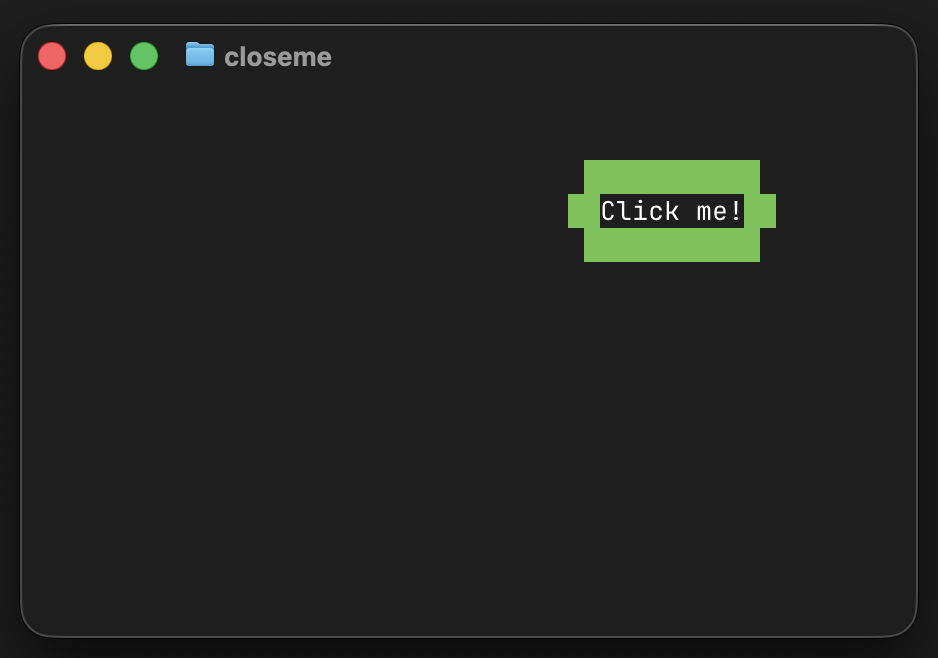

[](https://goreportcard.com/report/github.com/ansipixels/closeme)
[](https://github.com/ansipixels/closeme/releases/)
[](https://github.com/ansipixels/closeme/actions/workflows/include.yml)

# closeme

Fun little TUI where you try to close / click the box.



## Install
You can get the binary from [releases](https://github.com/ansipixels/closeme/releases)

Or just run
```
CGO_ENABLED=0 go install github.com/ansipixels/closeme@latest  # to install (in ~/go/bin typically) or just
CGO_ENABLED=0 go run github.com/ansipixels/closeme@latest  # to run without install
```

or
```
docker run -ti ghcr.io/ansipixels/closeme
```

or
```
brew install ansipixels/tap/closeme
```

## Usage

```
$ closeme help
closeme 1.0.0 usage:
        closeme [flags]
or 1 of the special arguments
        closeme {help|envhelp|version|buildinfo}
flags:
  -fps float
         Frames per second (ansipixels rendering) (default 60)
```
